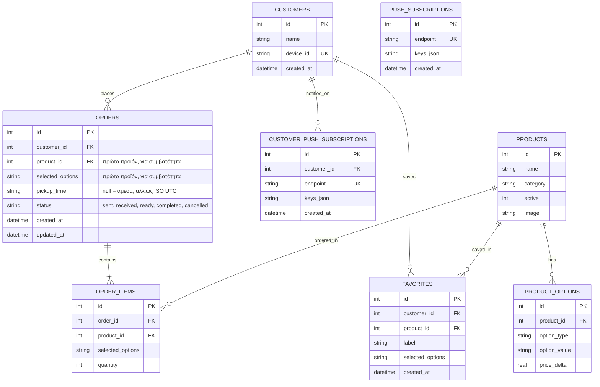

# BRUN — Αρχιτεκτονική

## Επισκόπηση

Το BRUN είναι μια PWA (Progressive Web App) για παραγγελίες καφέ. Χτίστηκε με **React + Vite** στο frontend και **Cloudflare Pages Functions** στο backend. Η βάση δεδομένων είναι **Cloudflare D1** (SQLite). Οι push notifications γίνονται μέσω **Web Push** (VAPID).

```mermaid
flowchart TB
    subgraph Client["Πελάτης (Browser / PWA)"]
        UI[React UI<br/>src/App.jsx]
        SW[Service Worker<br/>public/sw.js]
    end

    subgraph Pages["Cloudflare Pages"]
        direction TB
        subgraph Functions["Pages Functions (/api/*)"]
            F1[products.js<br/>GET]
            F2[customers.js<br/>POST]
            F3[orders.js<br/>GET, POST]
            F4[orders/[id].js<br/>DELETE]
            F5[orders/[id]/status.js<br/>PATCH]
            F6[favorites.js<br/>GET, POST]
            F7[push-subscriptions.js<br/>POST]
            F8[admin/login.js<br/>POST]
            F9[customer-push-subscriptions.js<br/>POST]
        end
        Assets[Static Assets<br/>dist/]
    end

    subgraph Data["Cloudflare D1"]
        DB[(cafe-orders-db<br/>SQLite)]
    end

    subgraph Push["Push Services"]
        PS[Browser Push<br/>Notification Service]
    end

    UI -->|fetch /api/*| Functions
    Functions -->|SQL| DB
    F3 -->|Web Push: νέα παραγγελία| PS
    F5 -->|Web Push: έτοιμη| PS
    PS -->|Notification| SW
    SW -->|Update| UI
    Assets -->|HTML/CSS/JS| UI

    style Client fill:#e1f5ff
    style Pages fill:#fff3e0
    style Data fill:#e8f5e9
    style Push fill:#fce4ec
```

## Stack

| Επίπεδο | Τεχνολογία |
|---|---|
| Frontend | React 19, Vite 8, CSS |
| Backend | Cloudflare Pages Functions (JavaScript) |
| Database | Cloudflare D1 (SQLite) |
| Auth | Custom HMAC token (admin), device-based (customer) |
| Push | webpush-webcrypto, VAPID |
| Hosting | Cloudflare Pages (same-origin) |
| CI/CD | GitHub → Cloudflare Pages auto-deploy |

## Δομή αρχείων

```
BRUN/
├── frontend/                  # Το Pages project (root directory στο dashboard)
│   ├── functions/             # Pages Functions — API endpoints
│   │   ├── _lib/shared.js     # Κοινά helpers (auth, push, DB utils)
│   │   └── api/
│   │       ├── products.js
│   │       ├── customers.js
│   │       ├── orders.js
│   │       ├── orders/[id].js
│   │       ├── orders/[id]/status.js
│   │       ├── favorites.js
│   │       ├── push-subscriptions.js
│   │       ├── customer-push-subscriptions.js
│   │       └── admin/login.js
│   ├── public/                # Static assets (manifest, service worker, logo)
│   ├── src/                   # React app
│   │   ├── App.jsx            # Main component (όλη η λογική)
│   │   ├── App.css
│   │   ├── index.css
│   │   └── main.jsx
│   ├── wrangler.toml          # Pages config + D1 binding (local dev)
│   └── package.json
├── worker/                    # Παλιός Worker — ΔΙΑΓΡΑΦΗΚΕ, μόνο για ιστορικό
│   └── migrations/            # SQL migrations (χρήσιμα για reference)
├── docs/                      # Αυτό το documentation
└── .gitignore
```

## Data Model (D1)



Κάθε παραγγελία έχει ένα ή περισσότερα `order_items` (migration `0012`). Παραγγελίες χωρίς `order_items` (πριν το `0012`) εμφανίζονται με το `orders.product_id` ως μοναδικό προϊόν.

## API Endpoints

| Method | Path | Auth | Περιγραφή |
|---|---|---|---|
| GET | `/api/products` | — | Λίστα ενεργών προϊόντων + options |
| POST | `/api/customers` | — | Δημιουργία/ενημέρωση customer (device_id) |
| GET | `/api/orders` | — | Τελευταίες 30 παραγγελίες customer (`?customerId=N`), με `items` |
| GET | `/api/orders` | Admin | Τελευταίες 150 παραγγελίες, με `items` |
| POST | `/api/orders` | — | Νέα παραγγελία `{ customerId, pickupTime, items: [{ productId, quantity, selectedOptions }] }` + push στον admin |
| DELETE | `/api/orders/:id` | Admin | Διαγραφή παραγγελίας και των items της |
| PATCH | `/api/orders/:id/status` | Admin | Αλλαγή status (sent→received→ready→completed). Στο `ready` → push στον πελάτη |
| GET | `/api/favorites` | — | Favorites customer (`?customerId=N`) |
| POST | `/api/favorites` | — | Νέο favorite |
| POST | `/api/push-subscriptions` | Admin | Εγγραφή συσκευής admin για νέες παραγγελίες |
| POST | `/api/customer-push-subscriptions` | Device | Εγγραφή συσκευής πελάτη για «έτοιμη» (`customerId` + `deviceId` πρέπει να ταιριάζουν) |
| POST | `/api/admin/login` | — | Admin login → JWT token |

Κανόνες του `POST /api/orders`: 1–20 γραμμές, ποσότητα 1–20 ανά γραμμή, σχόλιο έως 200 χαρακτήρες, `pickupTime` null ή ISO με ζώνη ώρας από 5 λεπτά πριν έως 3 ώρες μετά. Το παλιό body με ένα `productId` γίνεται ακόμα δεκτό.

## Authentication

- **Customer:** Αυτόματη ταυτοποίηση μέσω `device_id` (localStorage UUID). Χωρίς password.
- **Admin:** `ADMIN_ACCESS_KEY` → HMAC-signed JWT token (30 ημέρες expiry). Αποθηκεύεται στο `localStorage`. Το κουμπί «Διαχείριση» εμφανίζεται μόνο με `/?admin=true` ή σε συσκευή που έχει ήδη συνδεθεί.

## Push Notifications Flow

1. Admin πατά «Ενεργοποίηση ειδοποιήσεων» → εγγραφή σε `push_subscriptions`
2. Νέα παραγγελία (`POST /api/orders`) → `sendOrderPushes()` → Web Push σε όλες τις συσκευές admin
3. Πελάτης πατά «Ειδοποίησέ με όταν είναι έτοιμο» → εγγραφή σε `customer_push_subscriptions`
4. Admin πατά «Έτοιμη» (`PATCH …/status`) → `sendCustomerReadyPush()` → Web Push στις συσκευές του πελάτη
5. Service Worker ([public/sw.js](public/sw.js)) λαμβάνει το push και εμφανίζει notification (ένα ανά παραγγελία μέσω `tag`)

## Deployment

- **Auto-deploy:** Κάθε `git push` στο `master` → Cloudflare Pages build → deploy
- **Manual:** `cd frontend && npm run build && npx wrangler pages deploy dist --project-name=brunathens`

## Environment Variables / Secrets

| Όνομα | Τύπος | Πού | Σκοπός |
|---|---|---|---|
| `DB` | D1 Binding | Dashboard → Functions | Database |
| `ADMIN_ACCESS_KEY` | Secret | Dashboard → Env vars | Admin login |
| `VAPID_PRIVATE_KEY` | Secret | Dashboard → Env vars | Web Push signing |
| `VAPID_PUBLIC_KEY` | Hardcoded | `src/App.jsx`, `functions/_lib/shared.js` | Web Push subscribe |

> ⚠️ Το `VAPID_PUBLIC_KEY` είναι hardcoded — αν αλλάξει ποτέ, πρέπει να ενημερωθεί και στις δύο θέσεις και να γίνει redeploy.
